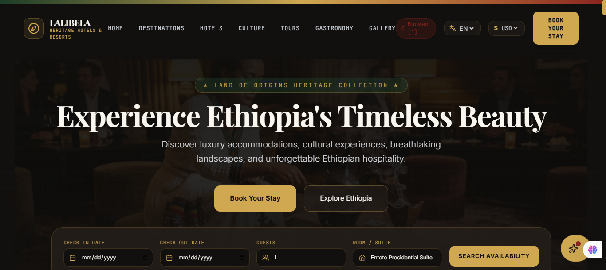
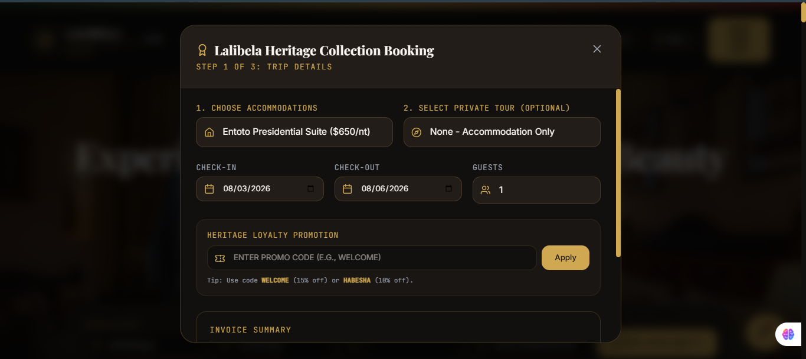
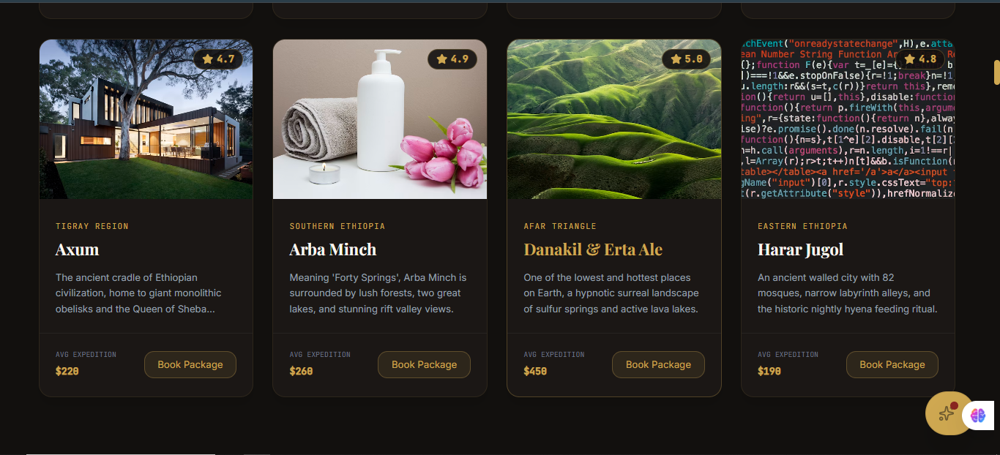
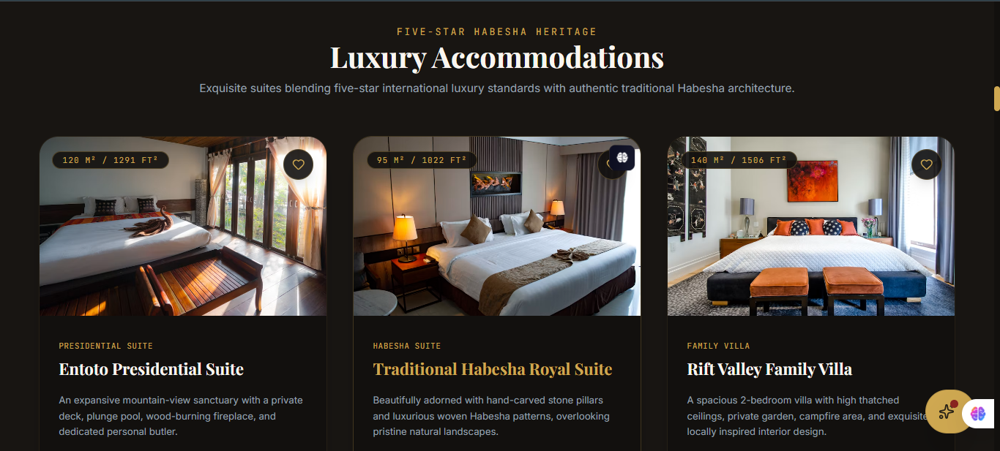
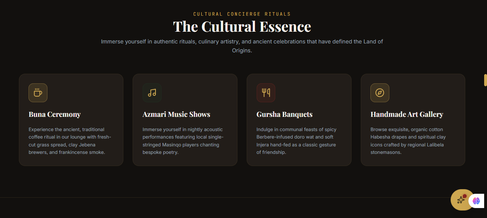

# 🏨 Elysium Abyssinia — Lalibela Heritage Hotels & Resorts

> **"Experience Ethiopia's Timeless Beauty — Discover luxury accommodations, cultural experiences, breathtaking landscapes, and unforgettable Ethiopian hospitality."**

[](https://nextjs.org/)
[](https://www.typescriptlang.org/)
[](https://tailwindcss.com/)
[](https://opensource.org/licenses/MIT)

---

## 📖 Overview

**Elysium Abyssinia** is an ultra-luxury web application designed for high-end Ethiopian hospitality. The application blends authentic imperial Habesha design aesthetics with modern web architecture, offering seamless interactive room bookings, regional heritage expedition planners, Habesha fine-dining table reservations, and real-time promo code engine calculations.

---

## ✨ Key Features & Highlights

* **🏨 Luxury Accommodations Engine:** Interactive room showcase (Entoto Presidential Suite, Traditional Habesha Royal Suite, Rift Valley Family Villa) with square footage breakdowns, interactive amenity selection, and instant availability checks.
* **📅 Multi-Step Booking Modal:** 3-step checkout drawer featuring date pickers, suite selections, custom private tour additions, dynamic invoice breakdowns, and promo code validation (`WELCOME` for 15% off, `HABESHA` for 10% off).
* **🗺️ Interactive Coordinates Map & Expedition Planner:** Interactive location coordinates mapping out top regional destinations (Axum, Arba Minch, Danakil & Erta Ale, Harar Jugol, Lalibela) alongside a custom blueprint itinerary wizard.
* **🍽️ Habesha Fine Dining & Gursha Reservation:** Culinary showcase featuring traditional dishes (Royal Doro Wat, Injera Platters) with integrated real-time table booking systems.
* **👑 Dark Luxury UI System:** Customized color palette utilizing rich gold accents (`#D4AF37`), deep obsidian dark backdrops (`#0F172A`), and high-contrast typography following strict accessibility guidelines.

---

## 🖼️ Interface Showcase

<div align="center">

### 🌟 Hero Section & Booking Portal


### 📅 Multi-Step Reservation Engine


### 🏨 Luxury Suites & Accommodation Grid


### 🗺️ Interactive Destination Coordinates Map


### 🍽️ Habesha Culinary Artistry & Gursha Table Booking


</div>

---

## 🛠️ Technology Stack & Architecture

```text
┌─────────────────────────────────────────────────────────────────────────────┐
│                         ELYSIUM ABYSSINIA ARCHITECTURE                       │
├──────────────────────┬──────────────────────┬───────────────────────────────┤
│   FRONTEND FRAMEWORK │   DESIGN & STYLING   │   STATE & LOGIC ENGINES       │
├──────────────────────┼──────────────────────┼───────────────────────────────┤
│ • Next.js (App Dir)  │ • Tailwind CSS       │ • Dynamic Modal Drawer State  │
│ • React (ES6+)       │ • Dark Gold Tokens   │ • Interactive Blueprint Form  │
│ • TypeScript         │ • Glassmorphic UI    │ • Promo Code Validation Logic │
│ • Lucide Icons       │ • Custom SVG Maps    │ • Modular Component Architecture│
└──────────────────────┴──────────────────────┴───────────────────────────────┘
